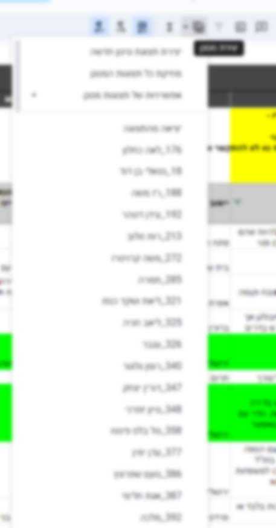

# HouseFinder
HouseFinder is a script that match between people who need house and people who have house to share.

The script uses Google Sheets API to create many different filter views.

This script was created during the war of October 7, 2024 - the day of the massacre by Hamas in Israel. 

### Prerequisites
* Python 3.11
* pip install -r requirements.txt
* pip install --upgrade google-api-python-client google-auth-httplib2 google-auth-oauthlib

## Example
#### filter for each person who need house in the spreadsheet of people who have house to share:
